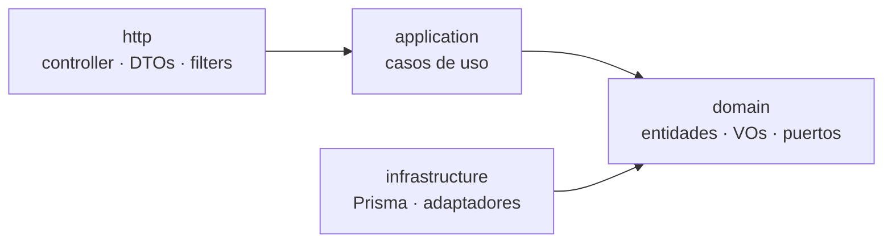

# Backend Vitto Club — Estructura y forma de trabajo

Grupo 11 (3K2), Seminario Integrador, UTN FRC.

Guía para entender cómo está armado el backend y cómo se trabaja en él.

## Estructura general

El backend es un **monolito modular** en NestJS: un solo proceso y un solo despliegue, con **un módulo por Epic** del Product Backlog. Dentro de cada módulo se usa **arquitectura hexagonal** (puertos y adaptadores): las reglas del negocio no saben nada de la base de datos ni de HTTP.

`customers` es el módulo de referencia: los demás replican su forma.

### Las cuatro capas

Todos los módulos tienen las mismas cuatro carpetas. La regla que ordena todo: **las dependencias apuntan hacia `domain`**, y `domain` no importa nada de afuera (ni NestJS, ni Prisma, ni Express).



| Capa | Pregunta que responde | Qué va acá | No puede depender de |
| --- | --- | --- | --- |
| `domain` | ¿Qué dice el negocio? | Entidades, value objects, errores de dominio y **puertos** (contratos) | Nada externo: ni NestJS ni Prisma |
| `application` | ¿En qué orden se hace? | Casos de uso: cargan entidades, consultan puertos, aplican reglas y guardan | `http` ni `infrastructure` (solo ve los puertos) |
| `http` | ¿Cómo entra y sale por la web? | Controllers, DTOs, Guards de rol y filtros de excepciones | Detalles de persistencia |
| `infrastructure` | ¿Cómo se hace técnicamente? | Implementación de los puertos con Prisma u otra tecnología | `http` |

Si un cambio no encaja en la pregunta de su capa, está en la capa equivocada.

### Forma de un módulo

```text
<modulo>/
├── application/        # casos de uso (servicios)
├── domain/
│   ├── errors/         # errores de dominio
│   └── port/           # puertos (contratos de persistencia)
├── http/
│   ├── dto/            # entrada y salida
│   └── filters/        # errores de dominio -> códigos HTTP
├── infrastructure/     # repositorios (implementan los puertos)
└── <modulo>.module.ts  # ensambla el módulo NestJS
```

En `domain/` también van las entidades, los value objects y sus `.spec.ts`. En la raíz del módulo solo queda el `.module.ts`.

## Cómo funciona un request

1. **`http`**: el `ValidationPipe` valida el DTO de entrada y el Guard comprueba el rol. El controller llama al caso de uso; no tiene reglas de negocio.
2. **`application`**: el servicio arma o carga la entidad y consulta el puerto del repositorio. Si se rompe una regla, lanza un error de dominio.
3. **`domain`**: la entidad valida sus invariantes al crearse; un dato inválido no llega a existir como objeto.
4. **`infrastructure`**: el repositorio implementa el puerto con Prisma y traduce entre la entidad y la tabla.
5. **De vuelta en `http`**: la respuesta se arma con un DTO de respuesta y el filtro del módulo traduce los errores de dominio a códigos HTTP.

### Puertos e inyección de dependencias

El servicio no conoce Prisma: pide un puerto y NestJS le entrega la implementación. En TypeScript las interfaces desaparecen al compilar, por eso el puerto se declara como `abstract class` o token de inyección. El `<modulo>.module.ts` es el único lugar que sabe qué implementación se usa y qué se exporta a otros módulos.

## Cómo se trabaja: crear un módulo (de adentro hacia afuera)

1. **Dominio primero.** Entidad, value objects y errores, con su `.spec.ts`. Se prueba sin base de datos ni NestJS.
2. **Puerto.** Se declara en `domain/port/` lo que el dominio necesita de la persistencia.
3. **Caso de uso.** En `application/` se escribe el servicio usando el puerto; se prueba con un repositorio en memoria.
4. **Persistencia.** Modelo en el schema de Prisma, migración e implementación del puerto en `infrastructure/`.
5. **Entrada HTTP.** DTOs, controller, Guards de rol y filtro de excepciones.
6. **Ensamblado.** Se registra todo en `<modulo>.module.ts` y se enlaza el puerto con su implementación.

El orden importa: las reglas quedan probadas antes de existir una sola tabla, y cambiar de idea sobre la base de datos no las toca.

## Reglas para trabajar

- **Un módulo no lee las tablas de otro.** Habla con su servicio exportado o con un puerto.
- **Las operaciones que tocan dos módulos van en una transacción.** El caso de uso abre una transacción de Prisma y ambos módulos participan en ella.
- **Los DTOs son el contrato con el frontend.** El front trabaja contra mocks (MSW) mientras el backend se construye en paralelo, así que un cambio en un DTO se avisa antes de mergear.
- **Los errores de dominio no conocen HTTP.** Cada módulo los traduce con su propio filtro.
- **El acceso por rol se aplica en el controller** con Guards, no dentro de los servicios.
- **Baja lógica siempre.** Se usa un estado (activo/inactivo); nunca se hace `DELETE` sobre datos del negocio.
- **Nombres en inglés y en plural por módulo:** carpeta `customers/`, archivos `customer.ts`, `customer.spec.ts`, `customer-already-exists.error.ts`, `create-customer.dto.ts`.
- **Trazabilidad:** cada commit referencia su historia (`US-XX`), como define el Working Agreement.

## Testing por capa

| Capa | Qué se prueba | Cómo |
| --- | --- | --- |
| `domain` | Entidades, value objects y reglas | Jest, sin dependencias |
| `application` | Casos de uso completos | Jest, con un repositorio en memoria que cumple el puerto |
| `infrastructure` | Repositorios contra una base real | Jest con PostgreSQL local (Docker Compose) |
| `http` | Rutas, validaciones, códigos de estado y permisos por rol | Jest + Supertest |

La mayoría de los tests corren en milisegundos porque no necesitan levantar nada: esa es la razón práctica de separar capas.
